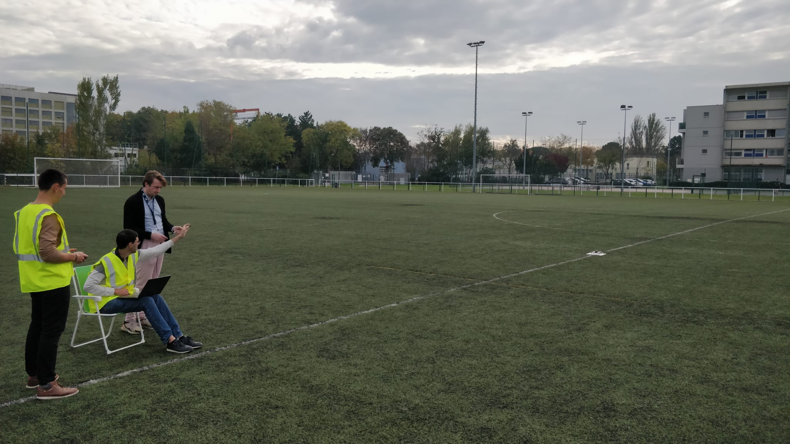
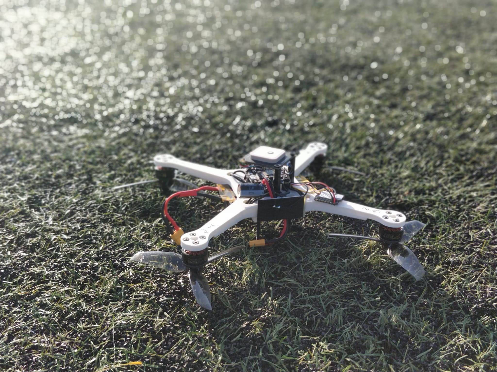

<!--  ENAC :  -->

Authorized flight tests of a new drone prototype at the ENAC campus !
Opening the sky for future real-world UTM and Swarm experiments.

<!--more-->

On Wednesday, 6th November 2024, ENAC research engineers Florian Sansou and Fabien Bonneval received authorisation to conduct flight tests on a newly developed drone prototype at the ENAC football field. This experiment, marking a significant milestone for the ENAC - Airbus - Sopra Steria Drones and UTM Research Chair, as a preparation for the upcoming real world experiments.

---

    

---

The custom drone that is developed aims to create a very simplistic, affordable model that is easily replicable, supporting future swarm operations within a limited budget. The testing protocol included three primary operations. The first test focused on the drone’s ability to maintain stable communication, navigating up to 80 meters away from the ground control station. Using IMU and GPS measurements, the second phase evaluated orientation accuracy, with the drone autonomously completing a path through three designated waypoints before returning for a successful landing. Finally, the endurance of the drone was tested in hovering mode, achieving over 25 minutes of continuous operation on a single battery charge, including the prior navigation tasks. This testing session promises a scalable, cost-effective solution for drone swarm applications, reinforcing the UTM Chair’s commitment at ENAC to advancing drone technology and innovation.

---

    

---