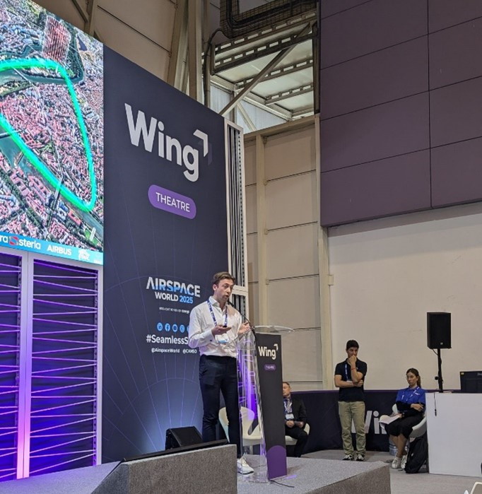

On May 12th, the **UTM Chair team** from ENAC took the stage at **Airspace World 2025** in Lisbon, alongside industry leaders **Sopra Steria** and **Airbus**, to present how we’re reimagining the way drones will fly over our cities soon. Our mission? To make urban air traffic **smarter**, **safer**, and **more efficient**—with a touch of innovation and a lot of teamwork.

<!--more-->

We demonstrated how our team uses **advanced simulations** to model how drones could navigate busy city airspace. Whether it’s just a few drones or an entire **swarm** flying together, we’re developing the tools to **manage, plan, and guide flights safely**, even in complex environments.

Visitors at our booth got a glimpse of our **collision avoidance algorithms**, a smart way to ensure drones don’t bump into each other in the sky. Think of it as **virtual air traffic control** tailored for urban drones.

---

  

---

### Cyclic Corridor Concept (C³)

One of the highlights of our presentation was the **Cyclic Corridor Concept (C³)**. Imagine a roundabout in the sky, looping through a city to connect drone landing spots (called **vertiports**). This design enables all drones to use the same shared routes, making the system **fairer**, **faster**, and **easier to manage**.

We explored two innovative approaches to bring this concept to life:

- **Artificial Intelligence**  
  We're training intelligent agents to design the smartest circular flight paths, staying close to vertiports while avoiding high-risk areas such as crowded zones, noise-sensitive neighbourhoods, and restricted airspaces.

- **Nature-Inspired Design**  
  Inspired by how **slime moulds** naturally spread to find optimal paths between food sources, this approach applies a similar logic. It generates more complex and adaptive patterns with strong potential to dynamically adjust the cyclic airspace corridor on demand.  
  _Matthieu worked hard on it and we’ll share more about this bio-inspired method in our next post this June!_

---

  

---

### Collaborative UTM

Representing Sopra Steria, our ATM/UTM expert collaborator **Yannick Seprey** highlighted the importance of:

- collaboration between service providers  
- clear communication and real-time data sharing  
- building public trust and social acceptance of drones in everyday life  

We showed that even if different drone operators use different technologies, they can **safely share the same airspace**, thanks to **interoperable systems** that work together behind the scenes.

---

### What’s Next?

Our **technical research papers** will be available in **September 2025**, offering detailed insights into the **C³ concept** and our simulation results.

**Drones are coming.** And we’re working hard to ensure their arrival is **safe**, **fair**, and **beneficial for all**.

---

📍 **Presented by:**  
**Murat Bronz** (ENAC) | **Rodolphe Frémond** (ENAC) | **Yannick Seprey** (Sopra Steria)  
📅 **Event:** Airspace World, Lisbon – 12 May 2025
